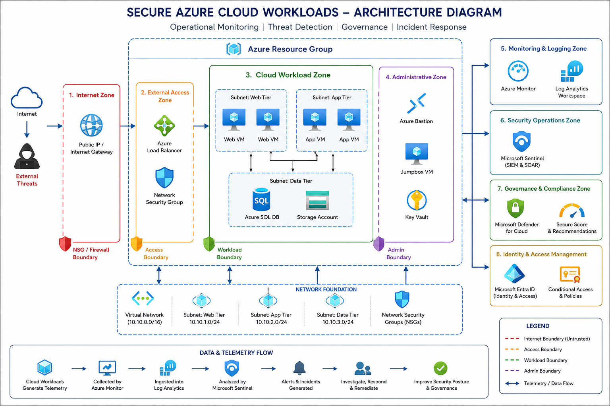
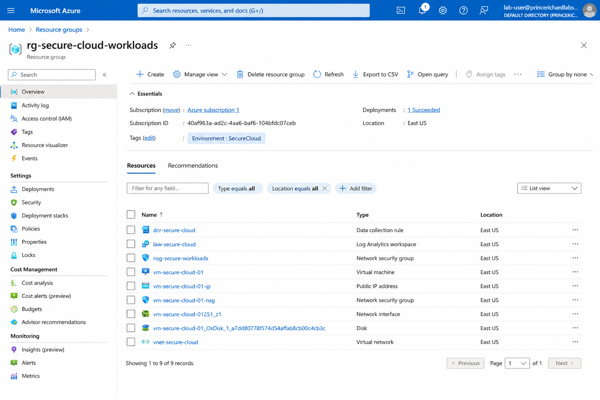
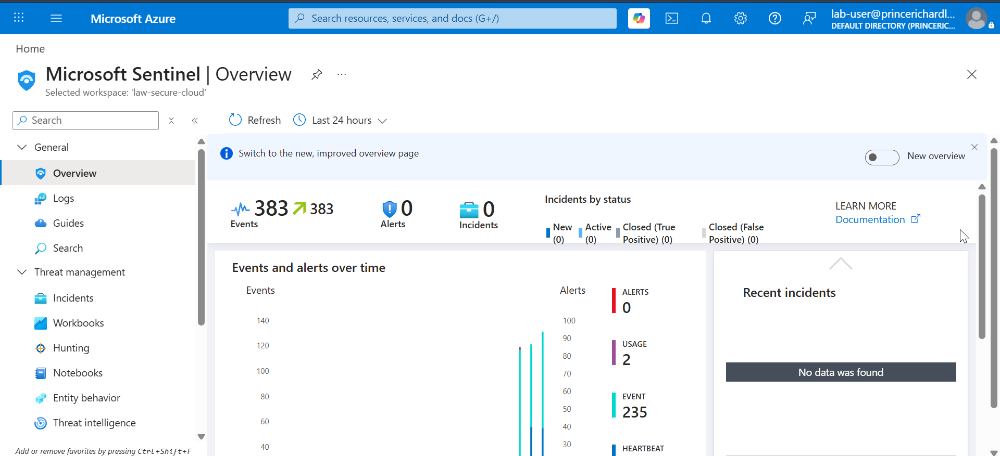
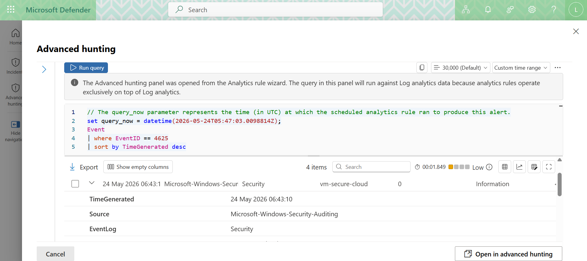
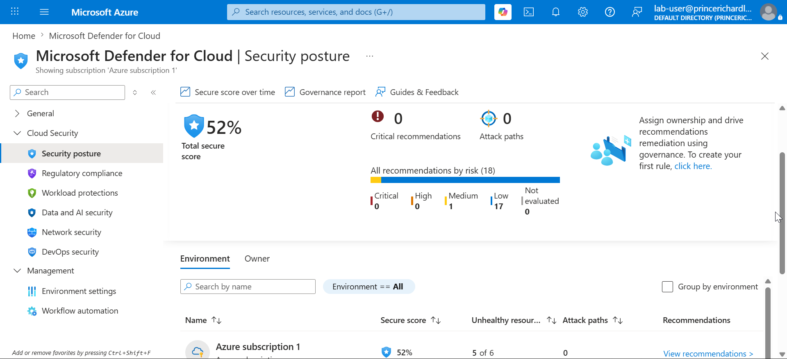

# Secure Azure Cloud Workloads

## Enterprise Cloud Security Engineering with Microsoft Sentinel & Defender for Cloud

This project demonstrates how Azure-native security services can be integrated to improve cloud monitoring, threat detection, governance visibility, incident investigation, and operational resilience.

The implementation focuses on practical cloud security engineering using Microsoft Sentinel, Microsoft Defender for Cloud, Azure Monitor, Log Analytics Workspace, Microsoft Entra ID, Azure Bastion, and KQL-based threat hunting workflows.

---

# Architecture Overview

<p align="center">
  
</p>

---

# Project Screenshots

## Architecture Overview

<p align="center">
  
</p>

## Microsoft Sentinel

<p align="center">
  
</p>

## Threat Hunting & Investigations

<p align="center">
  
</p>

## Governance & Secure Score

<p align="center">
  
</p>

---

# Executive Summary

Organizations increasingly rely on Azure workloads to support business-critical operations. As cloud environments grow, maintaining visibility, governance, and incident readiness becomes increasingly important.

This project demonstrates how Azure-native security services can be integrated to provide centralized monitoring, governance visibility, threat detection, incident investigation, and operational security oversight.

The implementation combines Microsoft Sentinel, Microsoft Defender for Cloud, Azure Monitor, Log Analytics Workspace, Microsoft Entra ID, and KQL investigations to create a practical cloud-native security operations environment.

---

# Key Capabilities

✅ Microsoft Sentinel SIEM Operations

✅ Microsoft Defender for Cloud Governance

✅ Azure Monitor Telemetry Collection

✅ Log Analytics Centralized Visibility

✅ KQL Threat Hunting & Investigations

✅ Incident Response Workflows

✅ Secure Score Monitoring

✅ Network Segmentation & NSGs

✅ Azure Bastion Secure Administration

✅ Cloud-Native Security Operations

---

# What This Project Implements

### Security Monitoring

* Microsoft Sentinel SIEM
* Azure Monitor
* Log Analytics Workspace
* Centralized telemetry collection
* Security dashboards and workbooks

### Threat Detection & Hunting

* Analytics Rules
* Incident generation
* KQL investigations
* Threat hunting workflows
* Authentication monitoring

### Governance & Compliance

* Microsoft Defender for Cloud
* Secure Score monitoring
* Security recommendations
* Governance visibility
* Posture management

### Cloud Security Architecture

* Network segmentation
* Network Security Groups (NSGs)
* Azure Bastion
* Identity-centric security
* Zero Trust principles

---

# Technical Skills Demonstrated

* Microsoft Sentinel
* Microsoft Defender for Cloud
* Azure Monitor
* Log Analytics Workspace
* Microsoft Entra ID
* Azure Bastion
* Kusto Query Language (KQL)
* Threat Hunting
* Detection Engineering
* Incident Response
* Security Monitoring
* Governance & Compliance
* Cloud Security Architecture
* Azure Security Operations

---

# Project Status

This repository is actively maintained and continuously evolving as Azure security capabilities, cloud threats, governance requirements, and operational monitoring practices continue to mature.

The project serves as:

* an enterprise cloud security engineering lab
* a practical Microsoft Sentinel implementation
* a cloud-native monitoring environment
* a governance visibility platform
* a continuous learning and research initiative

New detection scenarios, investigation workflows, governance controls, and monitoring capabilities will continue to be added as the project evolves.

---

# Business Problem

Many organizations struggle with:

* fragmented monitoring visibility
* limited telemetry correlation
* insufficient governance oversight
* delayed incident investigations
* cloud misconfigurations
* growing cloud attack surfaces

This project demonstrates how centralized monitoring, governance visibility, threat detection, and operational investigations can improve cloud security maturity and operational readiness.

---

# Architecture Highlights

| Principle              | Implementation                     |
| ---------------------- | ---------------------------------- |
| Centralized Visibility | Microsoft Sentinel + Log Analytics |
| Secure Administration  | Azure Bastion                      |
| Segmentation           | Virtual Network + NSGs             |
| Governance             | Defender for Cloud                 |
| Identity Security      | Microsoft Entra ID                 |
| Threat Detection       | Sentinel Analytics Rules           |
| Threat Hunting         | KQL Investigations                 |
| Operational Monitoring | Azure Monitor                      |

---

# Security Design Principles

The architecture was built around the following security principles:

* Centralized visibility
* Least privilege access
* Secure administration
* Network segmentation
* Continuous monitoring
* Governance visibility
* Threat detection and investigation
* Operational resilience

---

# Security Operations Workflow

```text
Azure Resources
        ↓
Azure Monitor
        ↓
Log Analytics Workspace
        ↓
Microsoft Sentinel
        ↓
Analytics Rules
        ↓
Incidents
        ↓
Investigation
        ↓
Response & Remediation
```

---

# Attack Surface Reduction Strategy

The architecture reduces operational risk through:

* segmented workloads
* NSG-controlled traffic
* Bastion-based administration
* centralized monitoring
* governance visibility
* identity-centric access controls
* continuous telemetry analytics

These controls help reduce exposure, improve visibility, and strengthen cloud operational resilience.

---

# Example Detection Scenarios

The environment supports investigation and monitoring of:

* failed authentication attempts
* suspicious sign-in activity
* administrative operations
* resource modifications
* workload anomalies
* governance findings
* telemetry anomalies
* threat hunting investigations

---

# Real-World Relevance

This implementation reflects security practices commonly used within enterprise Azure environments to improve:

* cloud monitoring visibility
* governance maturity
* threat detection capability
* operational preparedness
* incident investigation readiness
* cloud security resilience

---

# Implementation Phases

| Phase   | Focus                      |
| ------- | -------------------------- |
| Phase 1 | Architecture Foundation    |
| Phase 2 | Monitoring & Telemetry     |
| Phase 3 | Defender for Cloud         |
| Phase 4 | Microsoft Sentinel         |
| Phase 5 | Threat Detection & Hunting |
| Phase 6 | Incident Response          |
| Phase 7 | Governance & Compliance    |

---

# Documentation

## Strategic Documentation

* Executive Summary
* Business Case
* Threat Model
* Architecture Decisions
* MITRE ATT&CK Mapping
* Security Objectives

## Project Overview Documentation

* Project Scope
* Objectives
* Business Scenario
* Executive Summary
* Security Goals

## Technical Documentation

* Architecture Explanation
* Trust Boundaries
* Security Flows
* Threat Detection Strategy
* KQL Investigations
* Incident Response Workflows
* Governance Monitoring

---

# Repository Structure

```text
Secure-Azure-Cloud-Workloads/
│
├── README.md
├── LICENSE
├── .gitignore
│
├── EXECUTIVE-SUMMARY.md
├── BUSINESS-CASE.md
├── THREAT-MODEL.md
├── ARCHITECTURE-DECISIONS.md
├── MITRE-ATTACK-MAPPING.md
├── SECURITY-OBJECTIVES.md
├── ATTACK-SCENARIOS.md
├── LESSONS-LEARNED.md
│
├── 00-PROJECT-OVERVIEW/
│   ├── Project-Scope.md
│   ├── Objectives.md
│   ├── Business-Scenario.md
│   ├── Executive-Summary.md
│   └── Security-Goals.md
│
├── 01-ARCHITECTURE/
├── 02-DEFENDER-FOR-CLOUD/
├── 03-MICROSOFT-SENTINEL/
├── 04-THREAT-DETECTION/
├── 05-INCIDENT-RESPONSE/
├── 06-GOVERNANCE/
├── 07-KQL-QUERIES/
├── 08-DOCUMENTATION/
└── 09-BUSINESS-IMPACT/
```

---

# Technologies Used

* Microsoft Sentinel
* Microsoft Defender for Cloud
* Azure Monitor
* Log Analytics Workspace
* Microsoft Entra ID
* Azure Bastion
* Azure Virtual Machines
* Azure SQL Database
* Azure Storage Account
* Azure Load Balancer
* Azure Key Vault
* Network Security Groups
* Azure Activity Logs
* Microsoft Secure Score
* Kusto Query Language (KQL)

---

# Evidence & Validation

The repository contains implementation evidence including:

* architecture diagrams
* Microsoft Sentinel dashboards
* KQL investigations
* threat hunting queries
* incident investigations
* governance dashboards
* Secure Score assessments
* telemetry analytics
* monitoring configurations

---

# Skills Validated Through This Project

* Cloud Security Engineering
* Azure Security Operations
* SIEM Engineering
* Detection Engineering
* Incident Response
* Threat Hunting
* Governance & Compliance
* Security Monitoring
* Cloud Security Architecture
* Microsoft Sentinel Operations

---

# Relevant Security Roles

This project aligns with responsibilities commonly performed by:

* Cloud Security Engineer
* Azure Security Engineer
* Security Operations Engineer
* SOC Analyst
* Detection Engineer
* Security Architect
* Cloud Security Architect

---

# License

This project is licensed under the MIT License.

---

# Key Takeaway

This project demonstrates practical implementation of Azure-native cloud security monitoring, governance visibility, threat detection, incident investigation, and cloud security operations using Microsoft Sentinel, Microsoft Defender for Cloud, Azure Monitor, Log Analytics Workspace, Microsoft Entra ID, and KQL-based threat hunting workflows.
